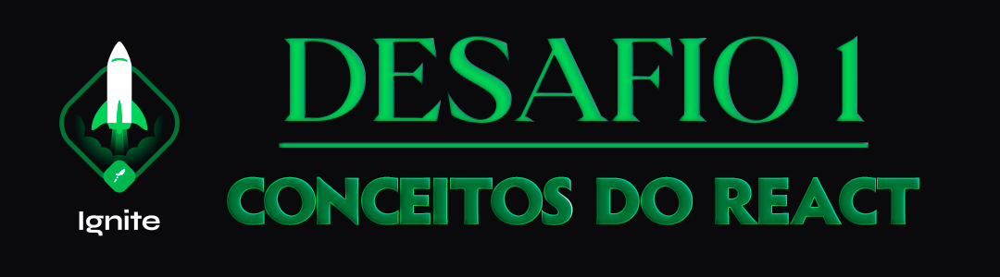

<p align="center">
  
</p>

## 💻 Sobre o desafio 01 - Conceitos do React

Neste desafio, você deverá criar uma aplicação para treinar o que aprendeu até agora no ReactJS.

Essa será uma aplicação onde o seu principal objetivo é uma pequena aplicação de atividades a fazer, para treinar um pouco mais sobre manipulação do estado no React.

- Adicionar uma nova tarefa
- Remover uma tarefa
- Marcar e desmarcar uma tarefa como concluída

## 📥 Instalação e execução

Clone este repositório e acesse o diretório.

```bash
$ git clone git@github.com:augustohermes/desafio-01-todo.git && cd desafio-01-todo

# Instalando as dependências necessárias
$ yarn

# Executando a aplicação
$ yarn start
```
